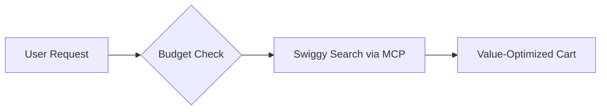

# Budget Guardian: Smart, Cost-Aware Ordering on Swiggy

## Problem
Solving the "Convenience Tax" for everyday users in India who want to save money. Food delivery apps are built for convenience, not cost-savings, often leading to overspending. 

## How it Works
Budget Guardian intercepts your ordering intent, checks your weekly allowance, searches for the best deals, and automatically builds a cart that fits your budget.

View Mermaid Source Code

## Technical Vibe
Built for the 2026 Agentic Commerce landscape, Budget Guardian leverages the **Model Context Protocol (MCP)** to securely interact with Swiggy and Instamart endpoints. It fully supports **Universal Commerce Protocol (UCP)** standards, integrating seamlessly with next-generation AP2 agent payment rules.

## Getting Started
1. **Set your Budget:** Configure your weekly allowance in the application settings.
2. **Start Searching:** Ask Budget Guardian for what you want (e.g., "Find me dinner for two under ₹400").
3. **Eat and Save:** Budget Guardian will find the best value and build your cart.