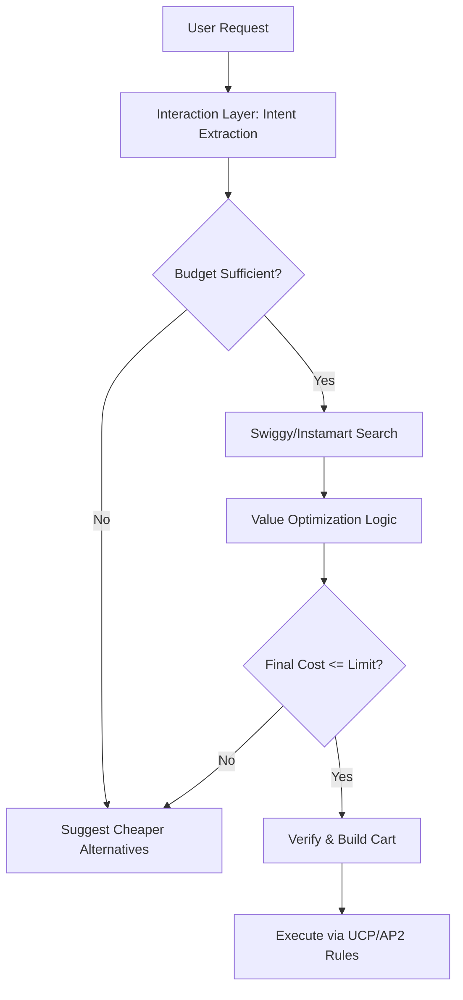

# Budget Guardian: System Blueprint

## Overview
Budget Guardian is an Agentic Commerce application designed to act as a financial intermediary between the user and Swiggy/Instamart. Its primary goal is to enforce weekly spending limits while maximizing the value of the user's food and grocery orders.

## Core Architecture
The system is built on a reactive architecture centered around the **Model Context Protocol (MCP)** and **Universal Commerce Protocol (UCP)**.

### 🛡️ Architecture Flowchart

View Mermaid Source Code

### 1. The Interaction Layer
- **Input:** Natural language requests from the user (e.g., "I need a heavy breakfast under ₹200").
- **Agent:** The AI evaluates the intent, extracting parameters like `query`, `max_price`, and `urgency`.

### 2. The Logic Layer (`src/guardian_logic.py`)
- **Budget Check:** Verifies the user's remaining weekly budget against a local ledger or database.
- **Value Optimization:** If a request is vague ("get me dinner"), the logic scans multiple restaurants, intentionally ignoring sponsored/promoted ads, and filters by the highest rating-to-price ratio.
- **Verification:** Pre-flight check before adding items to the cart to ensure the final total (including taxes, packaging, and delivery) strictly adheres to the user's set limit.

### 3. The Integration Layer (`config/swiggy_mcp_config.json`)
- **MCP Server:** Connects securely to the Swiggy environment.
- **Endpoints Used:**
  - `mcp.swiggy.com/v1/search`: Finding restaurants, items, and Instamart inventory.
  - `mcp.swiggy.com/v1/cart`: Building, validating, and modifying the user's cart.

## AP2 (Agent Payment Rules 2026) Compliance
Under the 2026 AP2 standards, autonomous purchasing agents cannot execute transactions that exceed pre-approved escrow bounds. 

- **Hard Ceilings:** If `cart_total > remaining_budget`, the cart assembly is immediately blocked.
- **Transparent Alternatives:** If the limit is exceeded, the agent must present a breakdown of costs alongside cheaper, viable alternatives.
- **Zero-Bypass:** The agent cannot be prompted or tricked into bypassing the weekly limit.

## Future Expansion
- **Instamart Auto-Restock:** Expanding the logic to handle staple grocery restocks based on household consumption rates.
- **Dynamic Budgets:** Allowing unused funds to roll over from week to week to incentivize saving.
